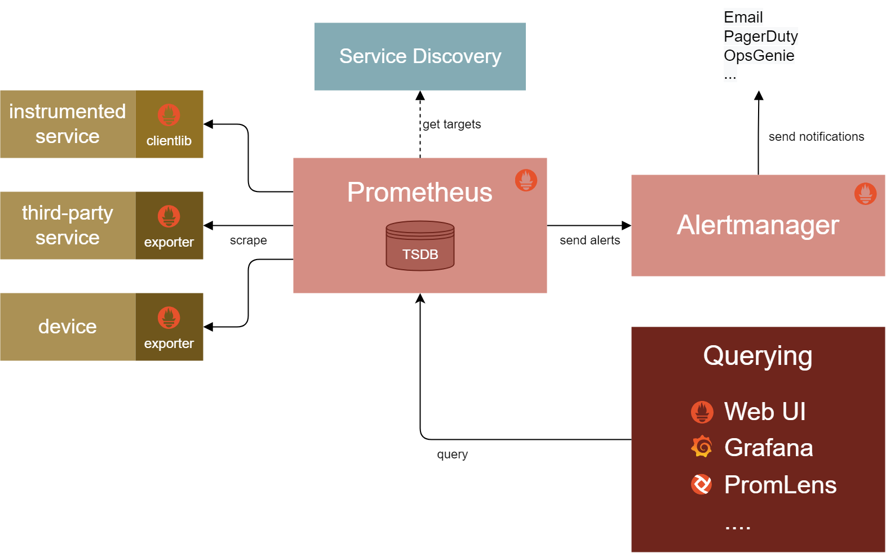

## Monitoring

### Why do we need monitoring?

- Let's say we have a application that has frontend, backend and database.
- Whenver a user create his account, He give his password and username in the frontend, then the frontend send the data to the backend, then the backend send the data to the database.
- Everytime when the user authenticate again, He will give his username and password, then the frontend will check the username and password in the database.
- What if the database is down? The user will not be able to authenticate.
- This will lead to a bad user experience.
- Users will never like to use the application again.
- So, we need to monitor our application and troubleshoot the issues before the user face the issue.
- we can manually monitor the application and troubleshoot the issues, but it will take lot of time and it is not efficient.
- So, we need to automate the monitoring process.
- We can use Prometheus and Grafana to monitor our application.

### Prometheus

- Prometheus is an open-source monitoring and alerting toolkit.
- It is a pull-based monitoring system.
- It is used to record real-time metrics in a time-series database.
- It uses **promQL** to query the data.
- **prometheus.yml file**:
    - The prometheus.yml file is used to configure the prometheus server.
    - We have to define targets in the prometheus.yml file, So that the prometheus server can scrape the data from the targets.
    - We can also configure alerts in the prometheus.yml file.
    
### Prometheus working Architecture:
    
    
#### Cons and Pros of Prometheus

- Prometheus is good at collecting and storing metrics.
- But it does not have a good visualization tool.
- So, we need to use Grafana to visualize the data.

### Expose Metrics

- By default, Prometheus will collect metrics from the system where it is running.
- Normally many applications expose metrics in the form of **/metrics** endpoint.
- But some applications do not expose metrics.
- In that case, we can use **exporters** to expose the metrics.
- **Exposing metrics in EC2** - We can use ```prometheus node-exporter``` to expose the metrics in EC2.
- **Exposing Metrics in Docker Daemon** - We have to edit the ```/etc/docker/daemon.json``` file to expose the metrics in docker daemon.
    - Copy the below code and paste it in the ```/etc/docker/daemon.json``` file.
    ```
    {
        "metrics-addr": "127.0.0.1:9323"
    }

### Grafana

- Grafana is an open-source visualization and analytics monitoring platform.
- It is used to visualize the data that is collected by Prometheus and other monitoring tools.

### Docker images for Prometheus and Grafana

- We can use the below docker images to run Prometheus and Grafana.
    - Prometheus: ```ubuntu/prometheus```
    - Grafana: ```grafana/grafana```